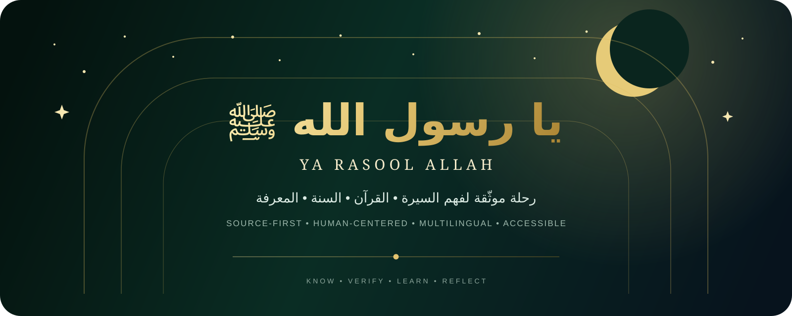
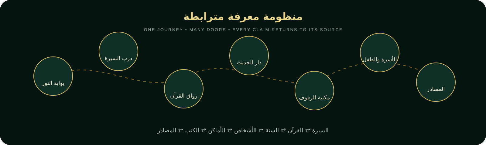
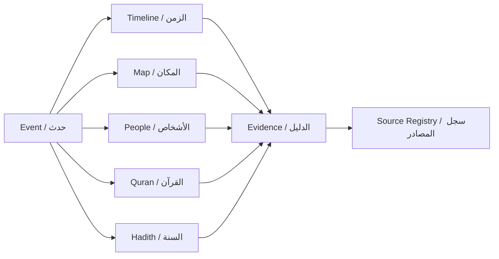
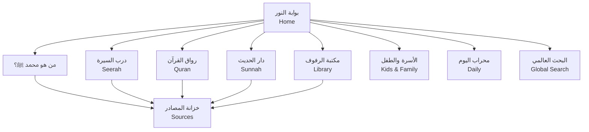
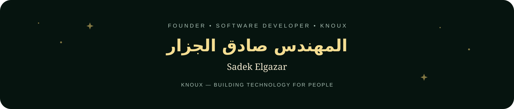

 

# ✦ يا رسول الله ﷺ ✦

### **منصة رقمية عالمية لفهم سيرة محمد بن عبد الله ﷺ، والقرآن الكريم، والسنة، والمعرفة الإسلامية من خلال مصادر واضحة وتجربة إنسانية حديثة.**

**A source-first digital institution for understanding the life, message and legacy of Prophet Muhammad ﷺ through Seerah, Quran, Sunnah, learning and verified sources.**

**Domain:** `yarasoolallah.it.com`

---

## ☾ لماذا هذا المشروع؟

هناك فرق بين أن يعرف الإنسان **اسم محمد ﷺ**، وبين أن يفهم **من هو محمد بن عبد الله ﷺ**.

**يا رسول الله ﷺ** يُبنى للإنسان الذي يسأل للمرة الأولى، وللطفل الذي يتعلم، وللمسلم الذي يريد أن يفهم أكثر، وللباحث الذي يريد الرجوع إلى المصدر، ولغير المسلم الذي يريد أن يقرأ بنفسه بعيدًا عن الاختزال والصور النمطية.

هذا ليس مشروع صفحات متفرقة.  
إنه محاولة لبناء **رحلة معرفة مترابطة** يستطيع فيها الزائر أن يرى السيرة في سياقها الزمني والجغرافي والإنساني، ويربط الحدث بالقرآن والسنة والأشخاص والأماكن والمصادر، ثم يفتح الدليل بنفسه.

> ### **نعرف العالم بمحمد بن عبد الله ﷺ من خلال سيرته الصحيحة، وكلام ربه، وسنته الموثقة، بلغة يفهمها كل إنسان.**

---

## ✦ المؤسسة الرقمية

التصور بعيد المدى هو بناء مؤسسة معرفية رقمية، لا واجهة دينية تقليدية.

| الجناح | الفكرة |
|---|---|
| **بوابة النور** | الصفحة الرئيسية والبوابة البصرية إلى المنصة |
| **درب السيرة** | رحلة زمنية وجغرافية في حياة النبي ﷺ |
| **رواق القرآن** | قراءة وبحث وتلاوة وترجمة وتفسير مع وضوح المصدر |
| **دار الحديث** | المجموعات والكتب والأبواب والأحاديث والتوثيق |
| **مكتبة الرفوف** | مكتبة رقمية تشبه المكتبة فعلًا، مع قارئ وكتالوج |
| **الأسرة والطفل** | تعلم آمن ومناسب للعمر، دون اختلاق أو تجسيد |
| **محراب اليوم** | الصلاة والقبلة والأذكار والتقويم والتعلم اليومي |
| **خزانة المصادر** | أصل المعلومة، الإصدار، المرجع وحالة المراجعة |
| **رفيق البحث** | ذكاء اصطناعي يساعد على الوصول والفهم، ولا يتقمص دور مصدر شرعي |

---

## ☾ **من هو محمد بن عبد الله ﷺ؟**

أحد أهم مسارات المنصة سيكون رحلة مستقلة للإنسان الذي **لا يعرف عن الإسلام إلا القليل أو لا يعرف عنه شيئًا**.

لن نفترض أن الزائر مسلم، ولن نلقي فوق رأسه مئات الصفحات من اللحظة الأولى.

يمر المسار عبر مراحل مثل:

| المرحلة | ما الذي يكتشفه الزائر؟ |
|---|---|
| **الإنسان قبل النبوة** | النسب، البيئة، الأسرة، الشباب، العمل والسمعة |
| **بداية الوحي** | كيف بدأت الرسالة وما السياق الذي أحاط بها |
| **مكة** | الدعوة، المجتمع، الصبر والابتلاء |
| **الهجرة** | الرحلة، الأماكن، الأشخاص والتحول التاريخي |
| **المدينة** | المجتمع، القيادة، العلاقات والاتفاقات والمسؤوليات |
| **البيت والأسرة** | المواقف الأسرية والإنسانية من مصادرها |
| **الأخلاق** | الرحمة، الصدق، العدل، الوفاء، التواضع والشجاعة |
| **الرسالة** | ماذا علّم؟ وكيف ارتبطت حياته بالقرآن والسنة؟ |
| **الدليل** | افتح المراجع واقرأ الأصل بنفسك |

**المبدأ:** لا نطلب من الإنسان أن يصدق واجهة جميلة.  
نعطيه طريقًا واضحًا إلى **المصدر**.

---

## ✦ The Flagship Knowledge Model

اختيار حدث في السيرة يجب أن يفتح شبكة مترابطة:

### **الحدث ⇄ الزمن ⇄ المكان ⇄ الأشخاص ⇄ القرآن ⇄ السنة ⇄ المصادر**

فتتحول السيرة من مجموعة تواريخ متناثرة إلى معرفة يمكن استكشافها وفهم العلاقات داخلها.

---

## 🧭 أربعة أعماق للتعلم

ليس كل إنسان يريد العمق نفسه، ولذلك نخطط لعرض الحقيقة الواحدة بدرجات مختلفة من التفصيل:

| المستوى | مناسب لـ | التجربة |
|---|---|---|
| **اكتشف · Discover** | الزائر الجديد | شرح مختصر، بصري وواضح |
| **تعلّم · Learn** | الدراسة المنتظمة | سياق وروابط ومراجع أكثر |
| **ادرس · Study** | القارئ الجاد | نصوص مطولة ومصادر واختلاف الروايات |
| **ابحث · Research** | الباحث | بيانات المصدر والإصدارات والتوثيق والفلاتر |

**المحتوى لا يغيّر الحقيقة بين المستويات. الذي يتغير هو عمق العرض وأدوات الدراسة.**

---

## ✦ «شاهد الدليل»

المعلومة الحساسة للمصدر لن تكون مجرد جملة جميلة على الشاشة.

طبقة الأدلة في المشروع مصممة لاستيعاب:

- اسم المصدر والمؤلف أو المصنف.
- الكتاب والباب ورقم السجل أو الحديث.
- الإصدار والترجمة.
- النص الأصلي عند توفره بشكل قانوني وموثوق.
- رابط أو صفحة المصدر.
- بيانات الاستيراد والمصدر الأصلي.
- حالة المراجعة التحريرية.
- تنبيه واضح عندما يكون التاريخ أو المكان تقريبيًا أو محل اختلاف.

**لا نسب ثقة وهمية. لا مراجع مخترعة. لا مصادر مصنوعة من أجل ملء الفراغ.**

---

## 📚 مكتبة الرفوف

المكتبة ليست متجرًا.

التصور النهائي يجمع ثلاثة أوضاع متكاملة:

### ① الرفوف البصرية
للاكتشاف والتصفح والشعور بأن المستخدم دخل مكتبة معرفة حقيقية.

### ② الكتالوج
للبحث السريع والفلاتر والوصول بلوحة المفاتيح وقارئات الشاشة.

### ③ مكتب القراءة
للقراءة المركزة، الحفظ، الملاحظات، التقدم، الصوت والمصادر.

الكتاب ليس «كارتًا».  
الكتاب **كيان معرفي** له مؤلف ومصدر وطبعة ولغة وحالة توفر وحقوق.

---

## 🌙 24 ساعة مع الهدي النبوي

مسار تعلم يومي يربط المعرفة بالحياة:

**الاستيقاظ → النظافة → الصلاة → الطعام → العمل → الكلام → الأسرة → الأطفال → الجار → الزيارة → السفر → المساء → النوم**

لكن من غير تحويل العبادة إلى لعبة نقاط.

لا يوجد:

- مقياس تقوى.
- ضغط نفسي للحفاظ على streak.
- تقييم ديني للإنسان.
- حكم شرعي مولّد من الذكاء الاصطناعي.

التقدم هنا يعني شيئًا واحدًا: **استمرار التعلم**.

---

## 👨‍👩‍👧‍👦 للأطفال والعائلة

تجربة الأطفال مخططة حول:

- مواقف موثقة ومناسبة للعمر.
- خرائط وأماكن وأشياء وعمارة.
- أسئلة فهم ومراجعة.
- مسارات تعلم تدريجية.
- رقابة أسرية.
- فيديوهات ومصادر آمنة.
- تصميم بصري لطيف دون تحويل السيرة إلى خيال.

### مبدأ بصري ثابت

**لا يتم تجسيد النبي محمد ﷺ بصورة أو وجه أو جسم أو Avatar أو صوت مولّد.**

نستخدم بدلًا من ذلك:

**الخط • الخرائط • العمارة • الأماكن • المخطوطات • الطبيعة • التسلسل الزمني • الضوء التجريدي**

---

## 🔎 بحث عالمي يفهم نوع المعلومة

البحث في المنصة مصمم للتمييز بوضوح بين:

`آية` • `ترجمة` • `تفسير` • `حديث` • `حدث سيرة` • `شخص` • `مكان` • `كتاب` • `باب` • `موضوع` • `محتوى أطفال` • `مصدر`

والقاعدة هنا بسيطة:

> **الذكاء الاصطناعي يساعدك في الوصول إلى المصدر، ولا يتنكر في هيئة المصدر.**

---

## 🛡️ ميثاق الأمانة العلمية

هذه ليست فقرة تسويقية. هذه قواعد منتج:

1. **لا نختلق** آية أو حديثًا أو درجة صحة أو رواية أو مرجعًا.
2. لا ننسب رأيًا إلى عالم أو مؤلف بلا مصدر.
3. المحتوى غير المراجع لا يظهر للعامة على أنه حقيقة موثقة.
4. نوضح متى يكون المكان أو التاريخ تقريبيًا أو محل اختلاف.
5. نفصل بين **النص الأصلي** و**الشرح الحديث**.
6. الذكاء الاصطناعي ليس مفتيًا ولا مصدرًا شرعيًا مستقلًا.
7. لا نجسد النبي ﷺ، ولا نصنع صوتًا يُقدَّم على أنه صوته.
8. المحتوى المفقود يظهر كحالة تحريرية صادقة بدل ملئه بمحتوى وهمي.
9. الجمال البصري لا يتقدم على الحقيقة.
10. كل ادعاء مهم يجب أن يمتلك طريقًا واضحًا إلى دليله.

---

## ✦ Product Architecture

---

## ⚙️ الاتجاه التقني

المنتج يُبنى ليخدم الويب والموبايل والتطبيقات مع بنية قابلة للتوسع.

### التقنيات المستهدفة / المستخدمة في الأساس

`React` • `TypeScript` • `Vite` • `Node.js` • `PostgreSQL` • `Supabase` • `PWA` • `Android` • `Capacitor` • `AI Integrations` • `CI/CD`

### أولويات هندسية

`RTL / LTR` • `Accessibility` • `Performance` • `Source Integrity` • `Mobile First` • `Offline Strategy` • `Security`

---

## 🧱 حالة المشروع

> **Foundation / Migration**

هذا المستودع هو الهوية الجديدة لمشروع **يا رسول الله ﷺ**، ويتم نقل وتطوير الأصول المفيدة من قاعدة **الكتاب المبين** مع إعادة بناء الهوية والتجربة والموثوقية.

لن نستخدم كلمات:

`Production Ready` • `Complete` • `100%`

إلا عندما توجد أدلة فعلية من:

**TypeScript • Build • Tests • Runtime • Browser QA • CI • Git SHA**

الهدف ليس أن يبدو المشروع مكتملًا قبل أوانه.  
الهدف أن يكون **ما نعلنه صحيحًا**.

---

## 🚧 خارطة الطريق

- [ ] تأسيس الهوية ونظام التصميم.
- [ ] نقل وتنظيف البيانات المفيدة من المشروع السابق.
- [ ] بناء بوابة النور.
- [ ] بناء رحلة «من هو محمد بن عبد الله ﷺ؟».
- [ ] بناء السيرة الزمنية والجغرافية.
- [ ] ربط السيرة بالمصادر والأشخاص والأماكن.
- [ ] تأسيس رواق القرآن بمصادر موثقة.
- [ ] تأسيس دار الحديث وهياكل التوثيق.
- [ ] بناء مكتبة الرفوف + القارئ + الكتالوج.
- [ ] بناء تجربة الأطفال والعائلة.
- [ ] بناء محراب اليوم.
- [ ] البحث العالمي.
- [ ] مركز المصادر والتحرير.
- [ ] رفيق البحث بالذكاء الاصطناعي مع citations.
- [ ] PWA وموبايل.
- [ ] Android foundation.
- [ ] iOS/Capacitor foundation.
- [ ] اختبارات الوصول والأداء والـRTL/LTR.
- [ ] التحقق التحريري من المحتوى قبل الإطلاق العام.

> **ملاحظة:** هذه خارطة طريق وليست ادعاءً بأن العناصر أعلاه مكتملة.

---

## 👨‍💻 المؤسس — المهندس صادق الجزار

**المهندس صادق الجزار** هو مطور برمجيات وصانع منتجات رقمية، ومؤسس **KNOUX**، وهي رؤية تقنية عربية طموحة تسعى إلى أن تصبح، بإذن الله، من العلامات الرائدة في **تطوير البرمجيات والذكاء الاصطناعي والحلول الرقمية والتقنيات الموجهة لخدمة الإنسان**.

يرى صادق أن قيمة التكنولوجيا لا تُقاس بعدد الأسطر البرمجية أو تعقيد البنية، بل بقدرتها على **حل مشكلات حقيقية، تبسيط حياة الناس، مساعدة أصحاب الأعمال، ومنح الإنسان أدوات تجعله أكثر قدرة وإنتاجية واستقلالًا**.

### رؤية KNOUX

تهدف KNOUX إلى بناء منظومة تقنية تجمع بين:

- تطوير البرمجيات والأنظمة الذكية.
- تطبيقات Windows وسطح المكتب.
- تطبيقات الهواتف المحمولة.
- منصات الويب والأنظمة السحابية.
- الذكاء الاصطناعي والأتمتة.
- أنظمة إدارة الشركات والعمليات.
- التجارة الإلكترونية والخدمات اللوجستية.
- أدوات الصيانة والمساعدة التقنية.
- تصميم وتجربة المستخدم UI/UX.
- حلول عملية تساعد الأفراد والشركات على الاستفادة الحقيقية من التكنولوجيا.

### الخبرة التقنية

**React • TypeScript • Electron • Android • Supabase • PostgreSQL • GitHub • Vercel • PowerShell • AI Integrations • CI/CD • Cloud Systems • UI/UX**

ويركز أسلوب العمل على تحويل الأفكار والنماذج الأولية إلى **منتجات حقيقية قابلة للاستخدام والتوسع والتحسين المستمر**.

### مشروعات ضمن الرحلة

**KNOUX Repair**  
منصة وأداة متقدمة لخدمات إصلاح وصيانة وتحسين Windows، مع تنظيم الأدوات والخدمات في تجربة موحدة قابلة للتوسع.

**KNOUX X**  
مشروع من منظومة KNOUX يستهدف بناء تجربة تقنية أكثر ذكاءً تجمع الأدوات البرمجية والذكاء الاصطناعي والخدمات الرقمية.

**Day Night Delivery Services**  
منظومة رقمية لخدمات التوصيل والشحن في دولة الإمارات، تشمل الطلبات والتجار والسائقين والتتبع والعمليات الإدارية.

**United Olympics Sports**  
منصة رياضية متكاملة تشمل الموقع العام والمتجر وبوابات الإدارة واللاعبين وأولياء الأمور والمدربين وأنظمة إدارة البيانات والعمليات الرياضية.

### فلسفة KNOUX

> **نبني ما يحتاجه الإنسان فعلًا.**  
> **نبسّط ما جعلته التكنولوجيا معقدًا.**  
> **نستخدم الذكاء الاصطناعي لمساعدة البشر، لا لإبعادهم عن دورهم.**  
> **ونحوّل الأفكار إلى أدوات ومنتجات حقيقية يمكن أن تترك أثرًا.**

الطموح هو أن تتطور **KNOUX** تدريجيًا إلى علامة تقنية عربية ذات حضور عالمي، تبني حلولًا أكثر سهولة وقوة وأمانًا للناس والشركات.

### **Technology should not only be powerful.**
### **It should be useful to humanity.**

## **KNOUX — Building Technology for People.**

**Founder:** Eng. Sadek Elgazar  
**Founder & Software Developer — KNOUX**  
**United Arab Emirates**

---

## 🤝 المساهمة

المشروع ما زال في مرحلة تأسيس. وعند فتح المساهمة العامة سنعطي أولوية للمساهمات التي تحترم:

- الدقة العلمية والتوثيق.
- جودة الكود والاختبارات.
- الوصول Accessibility.
- العربية وRTL من الدرجة الأولى.
- الخصوصية والأمان.
- احترام حقوق الكتب والترجمات والصوتيات.
- عدم تقديم محتوى ديني مولّد على أنه مصدر أصلي.

---

## ☾ ✦ ☾

### **يا رسول الله ﷺ**

**Knowledge with evidence. Design with purpose. Technology in service of people.**

 

`yarasoolallah.it.com`

 

**Built with care by KNOUX**

